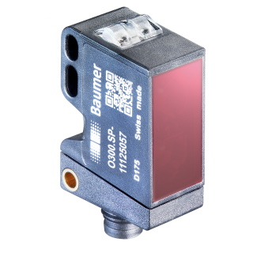
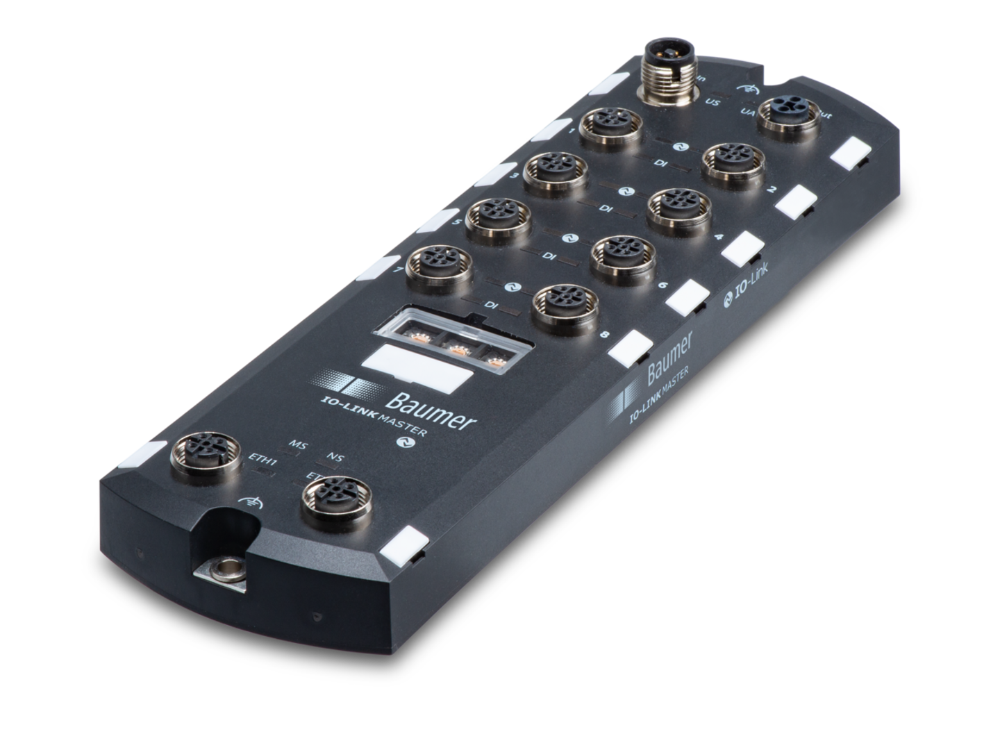
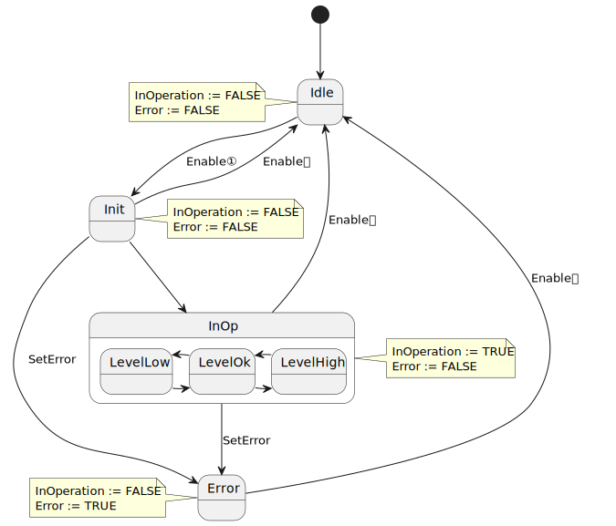
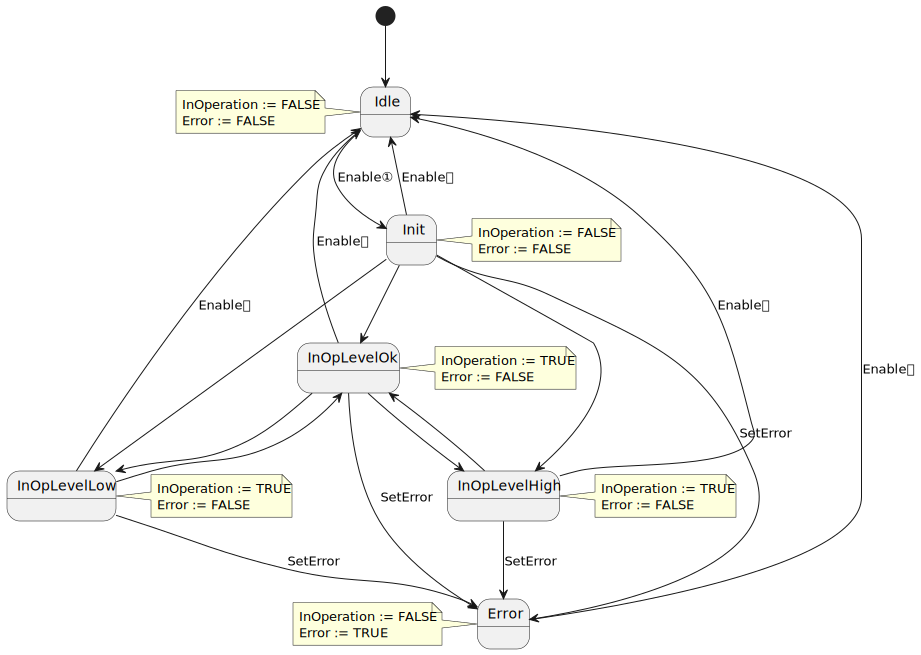
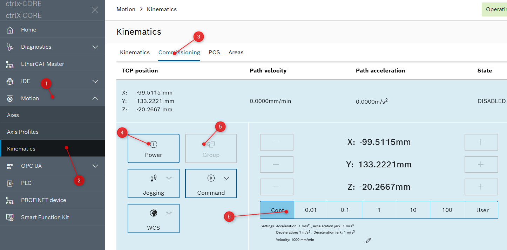
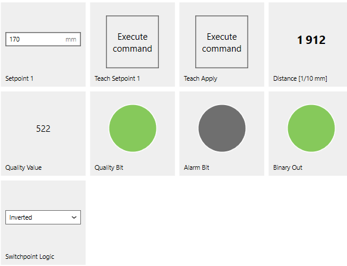

<h1 align="Left">
   
  
   
  HEI-Vs Engineering School - Industrial Automation Base
   
</h1>

Cours AutB

Author: [Cédric Lenoir](mailto:cedric.lenoir@hevs.ch)

# LAB 03 A complete function block for a sensor

Dans ce travail, nous allons construire un blocs fonctionnel complet pour un détecteur.

> Dans la plupart des IDE, dont ctrlX PLC, il existe la possibilité de créer des librairies de fonctions, types ou blocs fonctionnels. Nous n'abordons pas le sujet.

Avec un système de programmation empirique on pourrait se dire que tout ce dont nous avons besoin pour un capteur, c'est une entrée analogique ou digitale, donc en fin de compte, un ``REAL`` ou un ``BOOL``.

Dans la pratique, une simple entrée ou sortie sera entourée d'une logique qui permettra de la mettre en forme et de la valider. Afin d'éviter de réécrire la même logique pour chaque entrée et chaque sortie, nous allons encapsuler l'ensemble dans un bloc. Le Bloc fonctionnel.

# Sensor
Dans le cadre de ce travail pratique, nous utilisons un capteur laser d'origine Baumer.

<figure>
    
    <figcaption>Baumer-O300DL-11199079</figcaption>
</figure>

> Ce capteur utilise la technologie **IO-Link,** nous y reviendrons plus tard dans le cadre de ce cours. Ce qu'il faut en retenir: la conversion analogique numérique ne se fait pas au niveau d'une carte d'entrée analogique, mais à l'intérieur du capteur.

## Données techniques

|Intitulé                           |Valeurs|
|-----------------------------------|-------------|
|Distance de mesure Sd              |30 ... 250 mm|
|Forme du faisceau                  |point|
|Axe d‘alignement optique           |< 2°|
|Plage de tension +Vs1)             |11 ... 30 VDC
|Consommation max. (sans charge)    |30 mA|
|Tension résiduelle Vd              |< 2,5 VDC|
|Protégé contre inversion polarité  |oui|
|Protégé contre courts-circuits     |oui|
|Interface                          |IO-Link V1.1|
|Température de fonctionnement      |-10 ... +60 °C|
|Classe de protection               |IP 67|

> Ces données techniques concernent principalement la personne qui va gérer le hardware.

> Ce qui nous intéresse au niveau de la programmation PLC, c'est le format de donnée qu'il fournit.

## Données synchrones.
Les données **synchrones** sont celles qui sont transmises à interval de temps plus ou moins fixes. On les retrouve dans le tableau ci-dessous.

### IO-Link Processdata
|8-23|7|6|5|4|3|2|1|0|
|----|-|-|-|-|-|-|-|-|
|MDC1| | | | |A|Q| |BDC1|

**Q**: Le bit de qualité qui indique la qualité du signal est en dessous d'un seuil configuré.

**BDC1**: Etat de la sortie de commutation logique du capteur.

**A**: Le bit d’alarme signale l’existence d’un problème avec la configuration ou la fonctionnalité du capteur.

**MDC1**: Des valeurs de mesure continues du capteur.

> Nous allons travailler avec ces données.

## Données asynchrones.
Les données **asynchrones**, sont celles qui permettent soit de lire des caractéristiques du capteur. Soit de le paramétrer. Ci-dessous, une partie des paramètres sont montrés à titre d'exemple.

Les [paramètres pré définis](#io-link-pre-defined-parameters) permettent d'identifier le capteur. Les [paramètres des canaux binaires](#io-link-binary-data-channels) permettent de gérer un seuil, par exemple une détection, directement dans le capteur.

### IO-Link Pre defined parameters
|Index      |Subindex (dec) |Access |Parameter name |Coding |Definition|
|-----------|---------------|-------|---------------|-------|----------|
|0x000C (12)| 0             |R/W    |Device Access Locks| Uint16|0: Unlocked (default)
|           |               |       |             |       |1: Device is operating properly|
|0x0010 (16)| 0             |R      |Vendor Name| String|Baumer Electric AG|
|0x0011 (17)| 0             |R      |Vendor Text| String|www.baumer.com|
|0x0012 (18)| 0             |R      |Device Name| String|Product Key External (<Product Key Internal>)|
|0x0013 (19)| 0             |R      |Product Id| String|Baumer Article Number|
|0x0014 (20)| 0             |R      |Device Text| String|Sensor specific|
|0x0015 (21)| 0             |R      |Serial Number| String|Production Order Nr / Serial Nr |
|0x0017 (23)| 0             |R      |Firmware Revision| String|Major.Minor “##.##”|
|0x0018 (24)| 0             |R/W    |Application Specific Tag|String| Default: Filled with ******, as recommended by the IO-Link spec.|
|0x0024 (36)| 0             |R      |Device Status| Uint16| 0: Device is operating properly
|           |               |       |             |       | 1: Device is operating properly
|           |               |       |             |       | 2: Out-of-Specification
|           |               |       |             |       | 3: Functional-Check
|           |               |       |             |       | 4: Failure
|           |               |       |             |       | 5 - 255: Reserved|
|0x0025 (37)| 0             |R      |Detailed Device Status| Uint16| EventQualifier “0x00” EventCode “0x00, 0x00”

### IO-Link Binary Data Channels
|Index      |Subindex (dec) |Access |Parameter name| Coding| Definition|
|-----------|---------------|-------|---------------|-------|----------|
|0x003c (60)| 01            |R/W    | Setpoint SP1  |Uint16 |Teach Point [mm] (TP)|
|           | 02            |R/W    |Setpoint SP2   |Uint16 |Not supported|
|0x003d (61)| 01            |R/W    |Switchpoint logic|Uint8|0x00: not inverted 0x01: inverted|
|           | 02            |R/(W)  |Switchpoint mode|Uint8|Fixed value 0x01: Single point mode|

La gestion des paramètres asynchrones peut se faire directement dans le PLC. Cependant, la nature du PLC, dédié à des tâches cycliques, le rend peu efficace pour ce genre de travail. Il existe, par exemple chez Baumer, un logiciel, [Baumer Sensor Suite](https://www.baumer.com/us/en/products/baumer-sensor-suite/a/baumer-sensor-suite) qui permet de paramétrer directement les capteus sans passer par le PLC.

Le logiciel Baumer BSS mentionné est toutefois lié à un type de IO-Link Master, l'appareil qui sert de passerelle entre le monde IO-Link et le PLC.

<figure>
    
    <figcaption>IO-Link_Master_Profinet_8_Port_IP67</figcaption>
</figure>

Le contenu de ce module est une partie de la réponse au problème du paramétrage du capteur depuis le PLC. Même si nous n'allons pas le faire, le développement d'un Fonction Block, même complexe, pourrait permettre ensuite de paramétrer tous les capteurs d'une installation et être réutilisé pour les futures installation.

# Travail pratique
Nous allons coder un Function Block qui lit les données synchrone du capteur. Les informations seront ensuite mises en forme et codées pour utiliser directement les informations utiles.

- Distance, datatype: REAL, unité: mm
- Erreur de mesure ErrorID Code
- Seuils, Haut, Bas datatype: REAL, unité: mm 

## Description du Function Block

> Le Function Bloc a créer dans le répertoire PW_POU, *rigth click add object...*
> Les types à créer dans le répertoire PW_DUT, *rigth click add object...*

### Name
FB_O300_DL

### Input

|Name   |Type       |Description|
|-------|-----------|-----------|
|Enable	|BOOL	    |Activate Function Block, set data value in output if valid.|
|HighThreshold|REAL|Sets upper switching threshold|
|LowThreshold|REAL|Sets lower switching threshold|
|Other  |ANY        |[See below](#comportement-du-function-block)

### In Out
|Name   |Type       |Description|
|-------|-----------|-----------|
|hw |UA_O300_DL |In the particular context of the ctrlX to S7 interface.|

### Output
|Name         |Type         |Description         |
|-------------|:------------|--------------------|
|InOperation	|BOOL	        |Valid data at output|
|Value	|REAL	        |Distance from object in mm|
|Other  |ANY        |[See below](#comportement-du-function-block)
|Error	      |BOOL	        |There is an error   |
|ErrorID	    |WORD         |Some details about the error with Error Code.|

|ErrorID Code |Description|
|-------------|-----------|
|16#0000      |Data valid |
|16#0001      |Quality bit, signal is below the configured threshold.|
|16#0002      |Alarm bit, signal an error in sensor, this alarm has priority over ID 16#0001|
|16#0003      |Id not defined|

# Comportement du Function Block

### Model In Operation Base
Il existe quelques modèles de base de Blocs fonctionnels, en particulier un comportement dit *In Operation Base*. La surveillance d'un capteur est un exemple typique de ce genre de bloc. Il reste actif tans que l'entrée ``Enable`` est ``TRUE``. Il est à mettre en opposition à un bloc de type ``Execute`` qui provoque une action unique limitée dans le temps.

Le diagramme d'état d'un bloc fonctionnel de type Enable In Operation ressemble au digramme suivant: 

<figure>
    
    <figcaption>Function Block Enable In Operation Base</figcaption>
</figure>

Dans le cas qui nous intéresse, nous voulons obtenir deux informations supplémentaires qui sont directement dépendantes de la machine d'état.
### Output
|Name         |Type         |Description         |
|-------------|:------------|--------------------|
|HighLimit	  |BOOL	        |Valid signal above HighThreshold|
|LowLimit	  |BOOL	        |Valid signal above LowThreshold |

On pourrait la représenter ainsi:
<figure>
    
    <figcaption>Function Block Enable In Operation Base with Sub States</figcaption>
</figure>

Il serait théoriquement possible de passer directement de LevelLow à LevelHigh, mais cela n'apporte rien au fonctionnement général et implique des transitions supplémentaire.
Par contre, cette forme pourrait s'avérer un peu plus complexe à coder, personnellement je ne l'utilise pour ainsi dire jamais. Je préfère coder la forme complète.

<figure>
    
    <figcaption>Function Block Enable In Operation Base with More States</figcaption>
</figure>

On constate très vite, que même si le nombre d'états est limité, le représentation complète devient vite difficle à déchiffrer.

### Conclusion
Utiliser le diagramme d'état composé, quitte à coder des états simples.

### Sortie en cas de problème
Selon l'utilisation du capteur, une valeur lue erronée peut poser un problème.

Dans cet exemple, si la qualité du signal n'est pas correcte ou si nous nous trouvons hors détection, **nous ne voulons surtout pas d'une valeur 0**.

Nous ajoutons une entrée ``DefaultOut`` qui permet de définir une sortie par défaut. Nous testerons le système avec une valeur par défaut à 251, soit un mm de plus que la plage de mesure théorique du capteur.

# Pas à Pas

Dans le FB, il faut:

-   Convertir la grandeur d'entrée ``hw.Value`` dans une variable temporaire,
-   créer un Enum ``E_OperationBaseDL``
-   Créer une variable d'état ``eOperationBaseDL`` pour utiliser l'``Enum``.
-   Ecrire une machine d'état ``CASE...OF`` avec les différents états et les conditions de transition.
-   Définir les sorties, ``InOperation``, ``HighLimit``, ``LowLimit`` et ``Error`` qui dépendent uniquement des états.
-   Définir la variable ``ErrorId`` avec des conditions ``IF..ELSIF..ELSE``.
-   Autoriser la valeur à l'aide de ``IF..ELSE`` en fonction de InOperation.

Le ``FB`` est utilisé et testé dans ``PLC_PRG``, les entrées, telles ``Enable`` seront forcées à la manuellement.  

# Test
-   Utiliser Prosys OPC UA Monitor pour tester le comportement du capteur.
-   Utiliser le robot pour déplacer l'axe Z en face du capteur puis l'axe Y pour varier la distance de l'axe Z par rapport au capteur.
> Utilisez fbO300_DL dans PLC_PRG pour tester votre FB.

<figure>
    
    <figcaption>Use Kinematic For Test, 192.168.0.200</figcaption>
</figure>

# A propos du site Internet IO-Link
[Site internet général IO-Link](https://io-link.com)

[IODD Finder](https://ioddfinder.io-link.com/#/)

[Codage IO-Link on PLCopen, IEC61131-9](https://plcopen.org/iec-61131-9)

## SetPoint
On va inverser le **Switchpoint Logic**.
L'idée est d'utiliser l'axe Y du robot.
Si la distance descend en dessous d'un certain seuil, on déclenche une alarme.

<figure>
    
    <figcaption>Invert Switch Point Zero Below 160</figcaption>
</figure>

## Conclusion
On peut soit programmer un FB, soit utiliser les valeurs du capteur.

On peut aussi comprendre que pour un simple capteur, le temps de travail n'est pas négligeable, cela montre l'intérêt d'écrire une seule fois un FB robuste que l'on pourra ensuite réutiliser dans plusieurs projets.